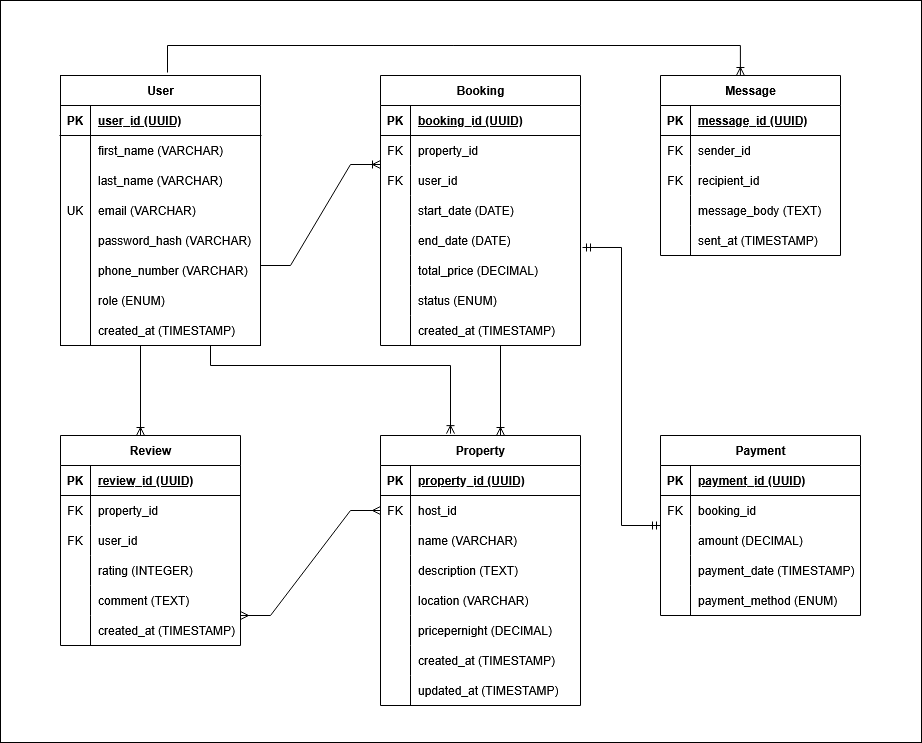

# Normalization
    - User table with a primary key user_id
    - Property table with a primary key property_id and foreign key host_id from User table
    - Booking table with a primary key booking_id and foreign key property_id from Property table
    - Payment table with a primary key payment_id and foreign key booking_id from Booking table
    - Review table with a primary key review_id, foreign key property_id from Property table
        and user_id from User table
    - Message table with a primary key message_id and foreign key reciever_id,
        recipient_id from User table